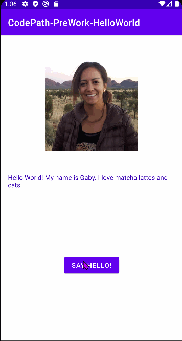
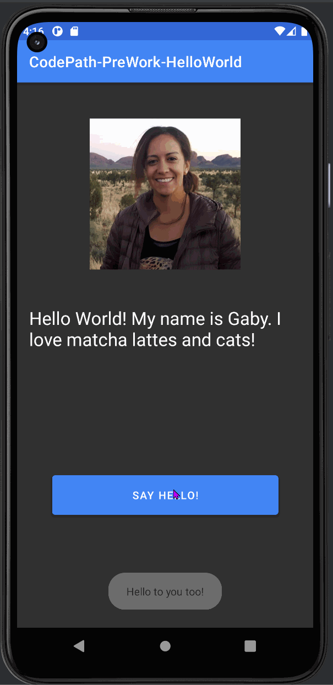

# Android Prework - *CodePath-PreWork-HelloWorld*

Submitted by: **Gabriela Liera**

**CodePath-PreWork-HelloWorld** is an android app that shows an image and introductory message, and allows pressing a button to display a Toast. 

Time spent: **3** hours spent in total

## Required Features

The following **required** functionality is completed:

* [x] Image and introductory message displayed on screen
* [x] Button displayed on screen
* [x] Toast with message appears when button is pressed 

The following **optional** features are implemented:

* [x] Added and updated colors and themes

## Video Walkthrough

Here's a walkthrough of implemented features:

Here is an update with new custom colors:

<!-- Replace this with whatever GIF tool you used! -->
GIF created with [LICEcap](https://www.cockos.com/licecap/).  
<!-- Recommended tools:
[Kap](https://getkap.co/) for macOS
[ScreenToGif](https://www.screentogif.com/) for Windows
[peek](https://github.com/phw/peek) for Linux. -->

## Notes
During the development of this app, I faced challenges related to color customization and gaining a clear understanding of the difference between primary color and primary color variant.

## License

    Copyright [2022] [Gabriela Liera]

    Licensed under the Apache License, Version 2.0 (the "License");
    you may not use this file except in compliance with the License.
    You may obtain a copy of the License at

        http://www.apache.org/licenses/LICENSE-2.0

    Unless required by applicable law or agreed to in writing, software
    distributed under the License is distributed on an "AS IS" BASIS,
    WITHOUT WARRANTIES OR CONDITIONS OF ANY KIND, either express or implied.
    See the License for the specific language governing permissions and
    limitations under the License.
